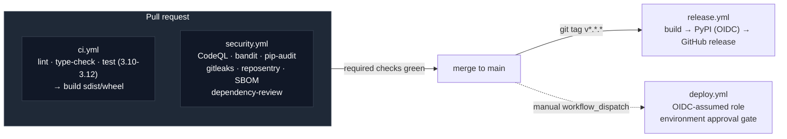

# Automation_1 — enterprise GitHub Actions reference

[](https://github.com/jarvicecore/automation_1/actions/workflows/ci.yml)
[](https://github.com/jarvicecore/automation_1/actions/workflows/security.yml)
[](LICENSE)

A reference implementation of a secure, scalable GitHub Actions setup —
the CI/CD patterns an enterprise platform team would want in place, applied
to a small real Python CLI (`reposentry`) rather than left as YAML with
nothing behind it.

**The pipeline is the point.** `reposentry` itself is a deliberately small
pre-merge secret/hygiene scanner — just complex enough to give the
workflows something real to lint, type-check, test, scan, package, and
deploy.

## Why this exists

Most "GitHub Actions example" repos show one workflow in isolation. This
one shows how the pieces fit together end to end: shift-left security
gates on every PR, supply-chain-hardened workflow files, credential-free
deploys, and pipelines that report back into the PR instead of requiring
someone to go dig through logs. Each non-obvious decision is written up as
an ADR in [`docs/adr/`](docs/adr/) rather than left implicit in the YAML.

## Pipeline overview



| Workflow | Trigger | What it does |
|---|---|---|
| [`ci.yml`](.github/workflows/ci.yml) | push/PR to `main` | Lint, type-check, and test across Python 3.10–3.12 via a reusable workflow; builds the package. |
| [`security.yml`](.github/workflows/security.yml) | push/PR to `main`, weekly | CodeQL SAST, `bandit`, `pip-audit`, `gitleaks`, `reposentry` self-scan, dependency-review (PRs), CycloneDX SBOM, OpenSSF Scorecard. |
| [`release.yml`](.github/workflows/release.yml) | tag `v*.*.*` | Re-verifies, builds, publishes to PyPI via OIDC trusted publishing, cuts a GitHub release. |
| [`deploy.yml`](.github/workflows/deploy.yml) | manual dispatch | Illustrative environment-gated deploy: OIDC-assumed cloud role, approval gate via GitHub Environments, failure notification. Deploy steps are marked as template placeholders — there's no real infrastructure behind this repo. |
| [`reusable-python-tests.yml`](.github/workflows/reusable-python-tests.yml) | `workflow_call` | The lint/type/test sequence, called once per matrix entry from `ci.yml`. |

## Security controls

| Control | Why | Where |
|---|---|---|
| Actions pinned to full commit SHA | A mutable tag (`@v4`) can be silently re-pointed by the action's maintainer or an attacker who compromises their account | every `uses:` line; [ADR 0001](docs/adr/0001-pin-actions-to-full-commit-sha.md) |
| OIDC federation, zero stored cloud/registry credentials | A leaked static access key/API token is valid until someone notices; an OIDC token is short-lived and scoped to this repo/environment | `deploy.yml`, `release.yml`; [ADR 0002](docs/adr/0002-oidc-over-long-lived-cloud-credentials.md) |
| Least-privilege `permissions:` | Default `contents: read` at workflow level, elevated per-job only where needed (`security-events: write` for SARIF upload, `id-token: write` for OIDC) | every workflow |
| Shift-left scanning on every PR | Catch secrets, vulnerable dependencies, and SAST findings before merge, not after | `security.yml` |
| Dependency-review gate | Blocks a PR that introduces a new dependency with a known high/critical CVE | `security.yml` → `dependency-review` job |
| SBOM generation | CycloneDX SBOM produced on every security run and attached to releases, for downstream vulnerability tracking | `security.yml`, `release.yml` |
| Dependabot on both ecosystems | Keeps dependencies *and* the pinned Action SHAs current automatically | [`.github/dependabot.yml`](.github/dependabot.yml) |
| Concurrency control | CI cancels superseded runs on the same ref (saves runner minutes); deploys queue instead of being cancelled mid-flight | `ci.yml`, `security.yml`, `deploy.yml` |

## Observability

Every workflow writes a human-readable summary to the job's
`$GITHUB_STEP_SUMMARY` (visible directly on the run page — no log-diving)
and uploads structured artifacts (JUnit XML, coverage XML, SARIF, SBOM,
bandit JSON) for anything that needs to be consumed by another tool. CodeQL
and OpenSSF Scorecard findings surface in the repository's Security tab.
`deploy.yml` posts to Slack on failure with a direct link back to the run.

## The application: `reposentry`

A pre-merge repository scanner with three checks: committed-secret patterns
(AWS/GitHub/Slack tokens, private key blocks, generic `key = "..."`
assignments), oversized files, and baseline hygiene (README/LICENSE/
.gitignore present). Zero runtime dependencies — stdlib only.

```bash
pip install -e ".[dev]"
reposentry .                                    # scan cwd, human-readable text
reposentry . --format markdown --fail-on error   # what CI runs
reposentry src --checks secrets                  # scope to one check / one directory
```

Exit code is non-zero once a finding at or above `--fail-on` severity is
present — that's the hook CI uses as a merge gate.

## Repo layout

```
src/reposentry/          the application
  checks/                 one pure function per check: (Path) -> list[Finding]
  cli.py                  argument parsing, check orchestration, exit code
  report.py               Finding model + text/markdown/JSON rendering
tests/                    pytest, one test module per check + CLI
.github/
  workflows/               the five workflows described above
  actions/setup-python-env/  composite action shared by every workflow
  dependabot.yml, CODEOWNERS, pull_request_template.md
docs/adr/                 architecture decision records
```

## Using this as a template

1. Replace `reposentry` with your own package under `src/`; keep the
   `checks/`-style pure-function shape if you want the same test ergonomics.
2. `ci.yml` and `security.yml` work unmodified for any Python package with a
   `pyproject.toml` exposing a `dev` extra.
3. `deploy.yml` needs real infrastructure: set the `AWS_DEPLOY_ROLE_ARN`,
   `AWS_REGION` repo/environment variables, configure the IAM OIDC identity
   provider trust policy on the AWS side, and replace the two placeholder
   steps with your actual deploy + smoke-test commands.
4. `release.yml`'s PyPI publish job needs a
   [trusted publisher](https://docs.pypi.org/trusted-publishers/) configured
   on the PyPI project — no token to generate or store.
5. Read [`docs/adr/`](docs/adr/) before changing the security-relevant
   decisions (SHA pinning, OIDC, permission scoping) — each one records the
   trade-off, not just the choice.

## Local development

```bash
python -m venv .venv && source .venv/bin/activate
pip install -e ".[dev]"
ruff check src tests && ruff format --check src tests
mypy
pytest
```

See [`CONTRIBUTING.md`](CONTRIBUTING.md) for the full checklist and
[`SECURITY.md`](SECURITY.md) for vulnerability reporting and scan coverage.

## License

[MIT](LICENSE)
