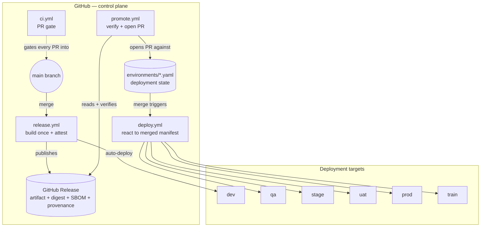
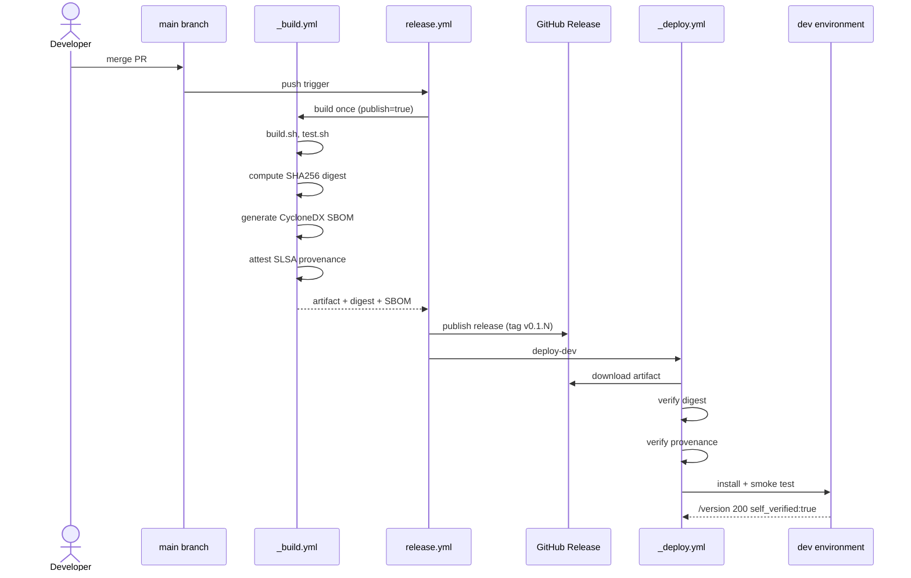
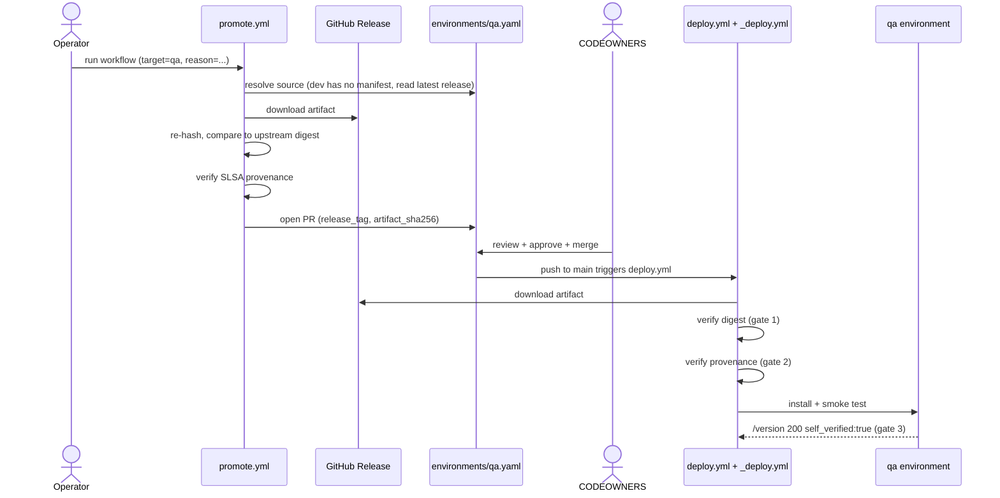
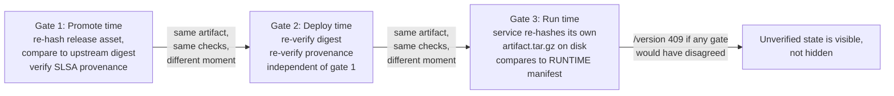

# Architecture

This document describes the system as it actually behaves: the components,
who talks to whom, what's verified and when, and where trust boundaries
sit. For *why* each piece is shaped this way, see [`docs/adr/`](adr/) — this
document is the map, the ADRs are the reasoning behind the roads.

## The core guarantee

> **Build once. Promote the same bytes. Never rebuild.**

Everything below exists in service of one property: the artifact identified
by a given SHA256 digest is the same artifact everywhere it runs, provably,
not by convention. See [ADR 0001](adr/0001-binary-promotion-over-rebuild-per-environment.md).

## Components



Everything in the `GH` subgraph is GitHub-hosted: source, Actions runners,
Releases, and the Environments that carry approval gates and per-environment
config. `TARGETS` are the six places an artifact actually runs — in this
repo, six containers in [`docker-compose.yml`](../docker-compose.yml); in a
production deployment, whatever `EXTRACT_TARGET` points `deploy.sh` at (see
[`docs/SETUP.md`](SETUP.md)).

Two workflows never appear as an edge into `TARGETS` directly:
[`_build.yml`](../.github/workflows/_build.yml) has no deploy step, and
[`_deploy.yml`](../.github/workflows/_deploy.yml) has no build step. Neither
can substitute for the other — that separation *is* the architecture.

## Release flow

Triggered by a merge to `main`. This is the only path that ever produces a
new artifact.



Notice that `_deploy.yml` re-verifies the digest and provenance of the
artifact it *just* watched `_build.yml` produce, in the same workflow run.
That's not redundant — it's the same code path every other environment
goes through, exercised on the very first hop rather than assumed to work
because it's "close to the build." See
[the three-gate model](#the-three-gate-verification-model) below.

## Promotion flow

Triggered manually, once per environment, by an operator who has decided a
release is ready to move forward.



The shape repeats identically for `stage`, `uat`, `prod`, and `train` — only
the source environment, the required approvers, and (for `prod`) a wait
timer change. See [ADR 0002](adr/0002-promotion-as-pull-request.md) for why
this is a pull request rather than a direct action, and
[`docs/USE_CASES.md`](USE_CASES.md) for what this looks like from an
operator's seat end to end.

## The three-gate verification model

The same two checks — does the digest match, does the provenance verify —
run three times, independently, at three different moments:



No single gate is load-bearing for the whole system. Gate 1 (`promote.yml`)
stops a bad artifact from ever reaching a promotion PR, so an approver never
reviews a proposal built on tampered bytes. Gate 2 (`_deploy.yml`) doesn't
trust gate 1's result — it re-downloads and re-verifies from scratch, so a
release asset altered *after* promotion was approved still gets caught.
Gate 3 (the running service itself, see
[`src/app/provenance.py`](../src/app/provenance.py)) doesn't trust either —
it re-hashes the actual bytes on disk at request time, so tampering with a
*running* environment (not just the artifact in transit) is still visible,
via `/version` returning `409` instead of quietly serving traffic.

`docs/USE_CASES.md`'s [tamper-detection scenario](USE_CASES.md#detecting-a-tampered-deployment)
walks through triggering gate 3 on purpose.

## Trust boundaries and permissions

The default `GITHUB_TOKEN` is read-only (`permissions: {}` at every
workflow's top level); every job opts in to exactly what it needs, visibly,
in the workflow file:

| Capability | Who has it | Why |
| --- | --- | --- |
| `id-token: write` (OIDC) | `_build.yml` (attestation), `_deploy.yml` (target federation) | Short-lived, scoped tokens instead of stored credentials — see [ADR 0010](adr/0010-oidc-over-long-lived-deploy-credentials.md). |
| `attestations: write` | `_build.yml`, release builds only | Only release builds (`publish: true`) may create provenance attestations. |
| `contents: write` | `promote.yml`, the `release` job in `release.yml` | Opening promotion PRs and publishing releases both write to the repo. |
| `security-events: write` | CodeQL, Snyk, Scorecard jobs | Required to upload SARIF to the code-scanning tab. |
| Everything else | `contents: read` or nothing | Deny-by-default. |

Every third-party (and first-party) Action is additionally pinned to a full
commit SHA — see [ADR 0009](adr/0009-pin-every-action-to-a-full-commit-sha.md)
— and `step-security/harden-runner` monitors network egress on every job.

## State model

`environments/*.yaml` is not a cache or a convenience — it *is* the
deployment state:

- [`promotion-path.yaml`](../environments/promotion-path.yaml) is static
  topology: which environment feeds which (`dev → qa → stage → uat → prod → train`).
- `qa.yaml`, `stage.yaml`, `uat.yaml`, `prod.yaml`, `train.yaml` each record
  exactly one thing that changes over time: the currently-deployed
  `release_tag` and `artifact_sha256`, plus who promoted it and when.
- `dev` has no file — see [ADR 0003](adr/0003-dev-has-no-manifest-file.md).

Because that state lives in git, `git log environments/prod.yaml` is a
complete, append-only audit trail of every release Prod has ever run and
who approved each change — no separate deployment-tracking system to keep
in sync.

## Reference

### Workflows

| Workflow | Trigger | What it does |
| --- | --- | --- |
| **CI** | `pull_request` → main, `merge_group` | Build (no publish), test, CodeQL, dependency review, Snyk, Sonar, `reposentry`. Ends in `ci-passed`. |
| **Release** | `push` → main *(ignores `environments/**`, `docs/**`, `*.md`)* | Builds **once**, attests provenance, publishes a GitHub Release, auto-deploys dev. |
| **Promote** | `workflow_dispatch` | Verifies digest + provenance, opens a promotion PR. |
| **Deploy** | `push` → main touching `environments/{qa,stage,uat,prod,train}.yaml` | Detects which manifest moved; deploys that environment. |
| **Scheduled Security** | `cron 17 3 * * *` | Full scan at `medium` severity, OpenSSF Scorecard, drift report. |

Reusable (`_`-prefixed, called by the above):

| Workflow | Purpose |
| --- | --- |
| **_build** | harden-runner → checkout → Python 3.12 → `build.sh` → `test.sh` → digest → SBOM → **attest** (release only) → upload. |
| **_security** | CodeQL matrix, dependency review, Snyk, SonarQube, `reposentry` (secrets/large-files/hygiene), plus a `gate` job that aggregates them. |
| **_deploy** | Downloads the release asset, verifies digest, verifies attestation, runs `deploy.sh` + `smoke-test.sh`. Bound to the GitHub Environment, so approval gates apply. |

**Why `ci-passed` and `gate` exist.** Required status checks are brittle when
pointed at matrixed or conditional jobs — a *skipped* job never reports, so
the check hangs forever. These aggregators always report and fail if any
upstream job genuinely failed. Point branch protection at `ci-passed` and it
stays correct no matter how many jobs get added above it.

**Versioning.** `VERSION` holds the base (`0.1`); the full version is
`<base>.<github.run_number>`, released as tag `v<version>`. PR builds get a
`-pr<N>` suffix and are never published.

### The reference app

Hello World that can prove which build of itself is talking.

| Endpoint | Returns |
| --- | --- |
| `GET /` | The greeting, plus a chain-of-custody card (HTML). |
| `GET /healthz` | `{"status":"ok"}`. Liveness only — used by the container healthcheck. |
| `GET /version` | Provenance. **200** if verified, **409** if not. |
| `GET /extract` | The extract + schema-contract validation. **422** if the contract is violated. |

`/version` payload:

```json
{
  "environment": "prod",
  "release_tag": "v0.1.7",
  "version": "0.1.7",
  "commit": "dfbb7d8",
  "built_at": "2026-07-11T23:25:59-06:00",
  "expected_sha256": "0c0e8fbe...",
  "observed_sha256": "0c0e8fbe...",
  "self_verified": true
}
```

[`provenance.py`](../src/app/provenance.py) reads `BUILDINFO` (baked in at
build time), reads `RUNTIME` (written by the deploy from the promotion
manifest), then re-hashes the tarball it was unpacked from and compares.
Unknown never counts as verified. The healthcheck deliberately probes
`/healthz`, not `/version`: an unverified service should be
reachable-but-failing so it can be inspected, not invisible.

### The Docker rig

Six long-lived containers that are deployment **targets**, not
applications — see [`docker-compose.yml`](../docker-compose.yml).

| Env | Port | Container |
| --- | --- | --- |
| dev | 8081 | `secure-release-pipeline-dev` |
| qa | 8082 | `secure-release-pipeline-qa` |
| stage | 8083 | `secure-release-pipeline-stage` |
| uat | 8084 | `secure-release-pipeline-uat` |
| prod | 8085 | `secure-release-pipeline-prod` |
| train | 8086 | `secure-release-pipeline-train` |

The image carries the Python runtime and pinned dependencies but **no
application code** — code only ever arrives as the promoted tarball,
installed by `deploy.sh`. Runs as a non-root user (uid 10001) with
`no-new-privileges`.

### Scripts

| Script | Runs where | State |
| --- | --- | --- |
| [`build.sh`](../scripts/build.sh) | CI + release | Deterministic tarball into `dist/`. |
| [`test.sh`](../scripts/test.sh) | CI + release | pytest + shell/YAML self-checks. |
| [`smoke-test.sh`](../scripts/smoke-test.sh) | After every deploy | Liveness → provenance → digest match → schema contract. |
| [`deploy.sh`](../scripts/deploy.sh) | Every environment | Real for `docker://`; stub for a real target — see [`docs/SETUP.md`](SETUP.md#6-point-deploysh-at-your-real-target). |
| [`demo.sh`](../scripts/demo.sh) | Local only | Build once, promote through all six. |
| [`bootstrap-github.ps1`](../scripts/bootstrap-github.ps1) | Local, once | Platform hardening via the GitHub API. |

Contract between build and deploy: **exactly one `dist/*.tar.gz`.**

## Where to go next

- **[`docs/adr/`](adr/)** — the reasoning behind each of the decisions above.
- **[`docs/USE_CASES.md`](USE_CASES.md)** — concrete scenarios from an
  operator's perspective.
- **[`docs/WALKTHROUGH.md`](WALKTHROUGH.md)** — run it yourself, locally and
  on GitHub.
- **[`docs/OPERATIONS.md`](OPERATIONS.md)** — configuration reference and
  troubleshooting.
